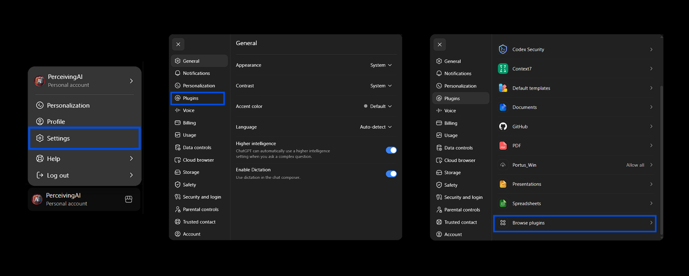
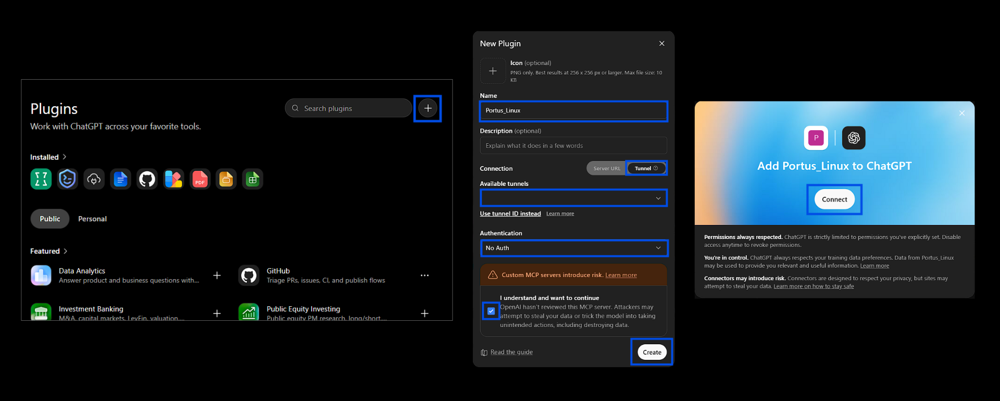
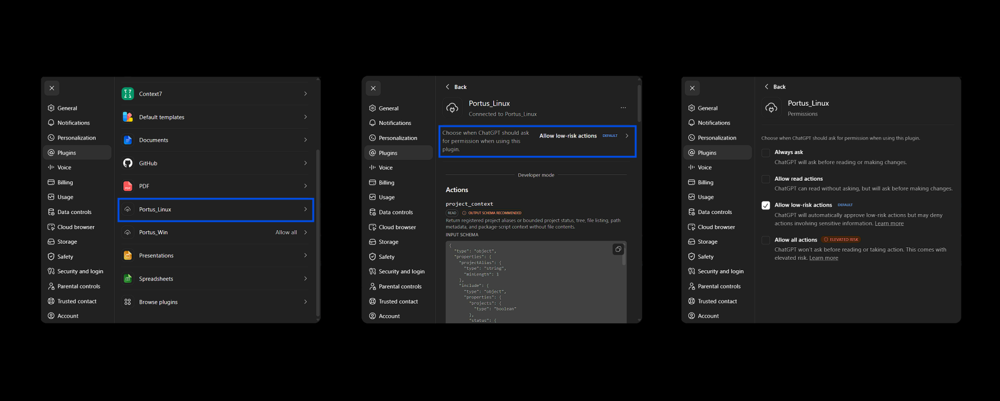

# Portus MCP

Portus MCP is an MCP server for AI-assisted project work across local machines, remote machines, and VMs. **The connection is the product; tools are policy-bounded adapters.** A client connects to a registered project through one server and uses a small broad surface for ordinary project mobility.

## Exposed Tool Surface

Portus MCP exposes one fixed nine-tool surface:

```text
project_context
project_read
project_search
project_edit
project_patch
project_run
project_policy
subagent_task
subagent_context
```

Together they provide alias-only project discovery, bounded project context, ordered reads, search, file and directory edits, patch preparation/application, approved execution, policy inspection/administration, and Flue subagent lifecycle management and context retrieval.


## Requirements

You need Node.js 20 or newer, npm, and Git.

For access from another machine or hosted client, use Tailscale Funnel, Cloudflare Tunnel, or another exposure layer that can reach the MCP server.

Provider credentials are needed only when spawning agents. The seven broad project tools and connected-agent skill reads do not require provider credentials.

## Install

```text
npm install
```

CI uses Node.js 20 with npm 10. Use npm 10 semantics when updating dependencies or regenerating `package-lock.json` so it stays compatible with `npm ci` in GitHub Actions.

Copy `.env.example` to `.env`. At minimum, register a project:

```text
PORTUS_MCP_PROJECTS=app=C:/path/to/project
```

Separate several projects with semicolons:

```text
PORTUS_MCP_PROJECTS=app=C:/path/to/app;api=C:/path/to/api
```

### Allow device commands

Portus ships with `portus-mcp.policy.json` as its default complete operator policy. If `PORTUS_MCP_POLICY_PATH` is unset, that shipped file is selected. To maintain a private policy, copy the complete shipped file to the Git-ignored `portus-mcp.policy.local.json`, edit it, and select it in `.env`:

```env
PORTUS_MCP_POLICY_PATH=./portus-mcp.policy.local.json
```

The selected file is a strict replacement, not an overlay: shipped and private policies are never merged. A missing file, invalid JSON, unknown key, or invalid value fails startup. Runtime files under `.portus-mcp/` cannot override permissions, and no MCP tool can mutate them.

Portus ships with only `git` in `main_agent.permissions.allowedCommands`. Add executable basenames to that field in the selected complete policy, not arguments or shell command strings; omit Windows `.exe`, `.cmd`, and `.bat` suffixes. Grant only commands you intend the connected main agent to control: allowlisting Bash, PowerShell, Python, Node.js, or another interpreter gives it the broad authority that executable has under the Portus OS account. Direct main-agent commands use `main_agent.permissions.allowedCommands`; spawned subagents use the separate `subagents.permissions.allowedCommands`. Restart Portus after changing `.env` or the selected policy.

The shipped `portus-mcp.config.json` configures default subagent retry behavior and traversal exclusions:

```json
{
  "subagents": {
    "defaultTemplate": "ephemeral-project-subagent"
  },
  "traversal": {
    "excludedPatterns": [".git", "node_modules", "dist", ".portus-mcp"]
  }
}
```

Keep the required application-config fields from the shipped file. Only add provider credentials when spawning subagents.
## Skills

Portus treats skills as configured, read-only filesystem packages—not as skill-specific MCP tools. Two environment variables select independent audiences:

```text
AGENT_SKILL_PATHS=./skills
SUBAGENTS_SKILL_PATHS=./skills
```

- `AGENT_SKILL_PATHS` populates the catalog available to the connected MCP client through `project_context` with `include.skills=true`.
- `SUBAGENTS_SKILL_PATHS` populates the catalog and read-only `/skills/<name>` mounts given to Portus-spawned agents.
- Each value accepts semicolon-separated individual skill directories or catalog directories.
- Relative paths resolve from the directory containing `portus-mcp.config.json`.
- An unset variable uses the local `./skills` catalog when it exists. An explicitly empty value disables that audience.
- No user, system, Codex, or other host skill directory is scanned implicitly.
- The current set of skills on the `./skills` folder are examples which should be replaced with your own skills.

Skills are startup snapshots. After adding, deleting, changing, or reconfiguring a skill, restart Portus; reconnect the MCP client or start a new spawned-agent session. There are no `skill_list`, `skill_read`, `skill_run`, or `agent_run_skill` tools.

## Start

```text
npm start
```

Local MCP endpoint:

```text
http://127.0.0.1:8789/mcp
```

Health endpoint:

```text
http://127.0.0.1:8789/
```

## Connect to ChatGPT with `tunnel-client`

Portus MCP can be connected to ChatGPT through OpenAI Secure MCP Tunnel using `tunnel-client`.

This section assumes you have already downloaded `tunnel-client`, created an OpenAI Platform tunnel, and set `CONTROL_PLANE_API_KEY`. It then creates the local `tunnel-client` profile used for Portus MCP. For the full setup, see `docs/TUNNEL_CLIENT.md`.

The local Portus MCP endpoint is:

```text
http://127.0.0.1:8789/mcp
```

### One-time tunnel profile setup

After creating a tunnel in OpenAI Platform and copying the tunnel ID, create a local `tunnel-client` profile that points to the Portus MCP HTTP endpoint:

```powershell
cd C:\tools\tunnel-client

.\tunnel-client.exe init `
  --profile portus-local `
  --tunnel-id tunnel_your_tunnel_id `
  --mcp-server-url "http://127.0.0.1:8789/mcp"
```

`CONTROL_PLANE_API_KEY` must be a regular OpenAI Platform API key used by `tunnel-client`. It is not the tunnel ID and it is not `PORTUS_MCP_BEARER_TOKEN`.

### Daily startup

#### Single-Command Launcher (Recommended)

Run both Portus MCP and `tunnel-client` together in one terminal:

```bash
npm run start:tunnel
```
*(Press `Ctrl+C` once to stop both processes cleanly).*

#### Two-Terminal Setup (Alternative)

Terminal 1 (Portus MCP):
```powershell
cd C:\path\to\portus-mcp
npm start
```

Terminal 2 (`tunnel-client`):
```powershell
cd C:\tools\tunnel-client
.\tunnel-client.exe run --profile portus-local
```
### Add the plugin in ChatGPT

In ChatGPT web:

```text
Click your account button at the bottom-left of the screen
-> Settings
-> Plugins
-> Browse plugins
```



Create and connect the plugin:

```text
1. On the Browse plugins screen, click the + button next to the Search plugins box.
2. In the new plugin modal, add a name that identifies the device, machine, or VM you are connecting to.
3. Select the Tunnel option.
4. From the tunnel dropdown, pick the tunnel for the device you want to use.
5. In the authentication dropdown, select No Auth.
6. Tick the disclaimer checkbox.
7. Click Create.
8. In the connection modal, click Connect.
```



After discovery, ChatGPT should see the Portus MCP tool surface:

```text
project_context
project_read
project_search
project_edit
project_patch
project_run
project_policy
subagent_task
subagent_context
```
To verify registered projects, ask ChatGPT to call `project_context` with `include.projects=true` and no `projectAlias`.

### Optional: change ChatGPT permission behavior

The MCP works without changing this setting. If you do not configure it manually, ChatGPT uses its default permission policy.

To choose a more granular permission policy:

```text
Click your account button at the bottom-left of the screen
-> Settings
-> Plugins
-> Find the Portus MCP plugin by the name you chose
-> Click it
-> Click "Choose when ChatGPT should ask for permission when using this plugin."
-> Select the permission option you want
-> Close the settings modal
```



The plugin settings menu also lets you connect, disconnect, or delete the Portus MCP plugin at any time.

### Shut down Portus MCP and the tunnel

When you want to close the MCP connection, stop both running processes:

```text
Terminal 1: stop Portus MCP
Terminal 2: stop tunnel-client
```

On Windows, you can usually stop each process with `Ctrl+C`.

Portus MCP and `tunnel-client` are separate processes. Both are required while ChatGPT is using the MCP.

## Use From Another Client & Tailscale Setup

For complete, detailed instructions on using Tailscale (Tailscale Serve for private inter-device mesh access and Tailscale Funnel for public cloud connectors like Perplexity), see the authoritative guide:

```text
docs/TAILSCALE.md
```
### Single-Command Launchers

Launch Portus MCP and Tailscale together in one terminal:

* **Public Cloud Connectors (Perplexity)**:
  ```bash
  npm run start:funnel
  ```
* **Private Inter-Device Mesh (Personal Devices)**:
  ```bash
  npm run start:serve
  ```
*(Press `Ctrl+C` once to stop both processes cleanly).*

To check your active Tailscale status and inspect your complete target MCP URL:

```bash
npm run tailscale:status
```

On systems where Tailscale requires elevation:

```text
sudo tailscale funnel 8789
```

Tailscale prints a root URL such as:

```text
https://machine.tailnet.ts.net/
```

Add the MCP path and configure the client for Streamable HTTP:

```text
https://machine.tailnet.ts.net/mcp
```

## Multi-Machine Use

Run Portus MCP on each machine you want to access. One MCP entry per machine keeps project roots and policies independently selectable:

```text
Portus_LinuxVM
Portus_WinRemote
Portus_Workstation
```

The same conversation can use multiple connections while each server retains its own registered roots, permissions, limits, and availability boundary.

## Security

Broad tools remain bounded by layered enforcement:

- connector, tunnel, MCP server, and process availability;
- registered project-root confinement;
- blocked-path, traversal, and Git-ignore policy;
- capability permissions and approved command policy;
- server-owned request, input, output, scan, patch, edit, timeout, and process limits;
- explicit confirmation for destructive or protected operations;
- durable, redacted audit for mutation and execution;
- operating-system permissions; and
- strict schemas and safe, project-relative errors.

Callers cannot raise server maxima or override path, permission, confirmation, or audit policy. Search excludes ignored paths by default; explicit ignored-path inclusion is confined to one request and requires selected-policy authorization. Read, context, search, policy inspection, and patch preparation remain unaudited; mutation, execution, and registration retain audit behavior. Errors and safe policy projections do not expose absolute roots, selected policy paths, secrets, command environments, or file contents.

Spawned subagents are command-capable processes bounded by Flue workspace isolation in `.portus-mcp/flue-workspaces/<sessionId>` and `subagentTask` permission policy.

## Project Cold Start

A client that does not yet know a project alias calls `project_context` with `include.projects=true` and no `projectAlias`. The result contains registered aliases only. It then selects an alias and calls scoped `project_context`; the default response includes effective execution capabilities such as `allowedCommands` before the client uses `project_run`. Any project-scoped context section still requires `projectAlias`.

Registration and audit inspection are native `project_policy` actions rather than separate management tools. Its safe policy checks are read-only; no MCP action can change permissions. See `docs/TOOLS.md` for the exact boundaries.

## Tool Operations

Use `project_read.requests[]` for reads, `project_context.include` for status, effective execution capabilities, and metadata, `project_search.requests[]` for batched searches (1-20 requests), `project_patch.mode` for patches, `project_run.requests[]` for batched process execution (1-10 requests), `project_edit.operations[]` for filesystem changes, and `project_policy` for policy checks or native administrative actions.

See `docs/TOOLS.md` for the current tool contract and `docs/BROAD_MOBILITY_SURFACE.md` for the architectural decision.

## Platforms

Windows and Linux were verified for the initial release. macOS is intended to use the same Node.js workflow but was not verified.

## Validation

```text
npm run check
npm test
npm run build
npm run flue:check
```

The broad-surface acceptance suite must also prove exact seven-tool default discovery, profile isolation, absence of retired names, strict schemas, normal workflows, permission and confirmation boundaries, Git-ignore and root policy, server limits, audit behavior, and safe errors without absolute-path or secret leakage.

## More Documentation

```text
docs/BROAD_MOBILITY_SURFACE.md
docs/CLIENTS.md
docs/CONFIG.md
docs/MULTI_MACHINE.md
docs/TUNNEL_CLIENT.md
docs/TOOLS.md
docs/TROUBLESHOOTING.md
docs/VALIDATION.md
SECURITY.md
```

Start with `docs/BROAD_MOBILITY_SURFACE.md`, `docs/TOOLS.md`, `docs/CLIENTS.md`, `docs/MULTI_MACHINE.md`, and `docs/TUNNEL_CLIENT.md` for OpenAI Secure MCP Tunnel client setup.

Flue provides spawned-agent support. Direct broad MCP project tools work without spawned agents.

Flue: https://github.com/withastro/flue
